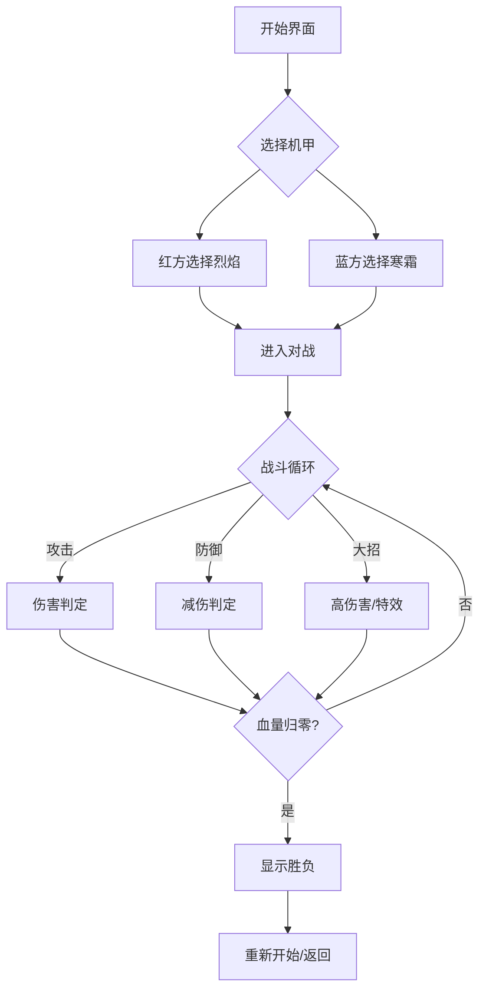

# 像素风机甲对战游戏 - 产品需求文档

## 1. 产品概述

一款复古像素风格的机甲对战小游戏，两位玩家操控各自的机甲进行1v1战斗。

- 核心目标：通过移动、攻击、防御等操作削减对方血量，最终击溃对手
- 目标用户：休闲游戏玩家、像素游戏爱好者
- 产品价值：提供简单上手但充满策略性的对战体验，重温经典街机格斗游戏的乐趣

## 2. 核心功能

### 2.1 游戏角色

| 角色名称 | 外观特点 | 攻击类型 | 特色 |
|---------|---------|---------|------|
| 红色机甲「烈焰」 | 红色系、火焰涂装 | 近战拳击 | 攻击力高 |
| 蓝色机甲「寒霜」 | 蓝色系、冰霜涂装 | 远程激光 | 攻击距离远 |

### 2.2 功能模块

1. **机甲选择界面**
   - 显示两个机甲预览
   - 悬停显示机甲属性预览
   - 点击确认进入对战

2. **对战场景**
   - 像素风格工业场景
   - 地面平台
   - 简单背景装饰

3. **战斗系统**
   - 血量显示（每方100点）
   - 能量条（用于释放技能）
   - 攻击动画与特效
   - 防御姿态
   - 胜负判定

4. **控制方案**
   - **玩家1（P1）**：WASD移动，J攻击，K防御，U大招
   - **玩家2（P2）**：方向键移动，小键盘1攻击，2防御，3大招

5. **游戏状态**
   - 开始界面
   - 对战中
   - 胜利/失败结算
   - 重新开始选项

## 3. 核心流程

### 3.1 游戏流程图

### 3.2 伤害计算

- 普通攻击：造成15点伤害
- 大招攻击：造成35点伤害，但消耗全部能量
- 防御状态：受到伤害减少70%
- 能量恢复：每2秒恢复10点能量

## 4. 视觉设计

### 4.1 整体风格

- **风格定位**：90年代街机像素游戏风格
- **分辨率**：低分辨率像素渲染（320x180逻辑像素，放大显示）
- **帧率**：60fps游戏循环

### 4.2 色彩方案

| 元素 | 颜色 | 说明 |
|-----|------|------|
| 主背景 | #1a1a2e | 深空蓝黑 |
| 地面 | #4a4e69 | 工业灰 |
| P1机甲 | #e63946 | 烈焰红 |
| P2机甲 | #4361ee | 寒霜蓝 |
| 血量条 | #2ec4b6 | 青色 |
| 能量条 | #f4a261 | 橙色 |
| UI文字 | #f1faee | 浅白 |
| 特效光效 | #ffd166 | 金黄 |

### 4.3 像素动画

- 机甲待机：2帧循环呼吸动画
- 机甲移动：4帧走路循环
- 攻击动作：3帧出拳/激光
- 防御动作：2帧举盾
- 受击反馈：闪烁+后退

### 4.4 特效设计

- 攻击命中：像素火花四散
- 大招释放：屏幕震动 + 光效
- 防御成功：能量盾波纹
- 胜负结算：大字特效动画

## 5. 音效与反馈

- 像素8-bit风格音效
- 攻击命中音效
- 防御成功音效
- 大招释放音效
- 胜负判定音效

## 6. 技术实现方案

### 6.1 渲染方式

- HTML5 Canvas 2D
- 像素-perfect渲染（关闭抗锯齿）
- 双缓冲绘制

### 6.2 素材来源

- 使用Canvas程序化生成像素机甲
- 背景使用程序化生成的像素场景
- 特效使用粒子系统实现

## 7. 验收标准

- [ ] 两个机甲可正常选择
- [ ] P1/P2控制各自机甲正常移动
- [ ] 攻击能正确命中对手并扣除血量
- [ ] 防御能正确减伤
- [ ] 大招消耗能量并造成高伤害
- [ ] 血量归零时显示胜负
- [ ] 可重新开始游戏
- [ ] 像素风格视觉呈现完整
- [ ] 无明显卡顿或bug
