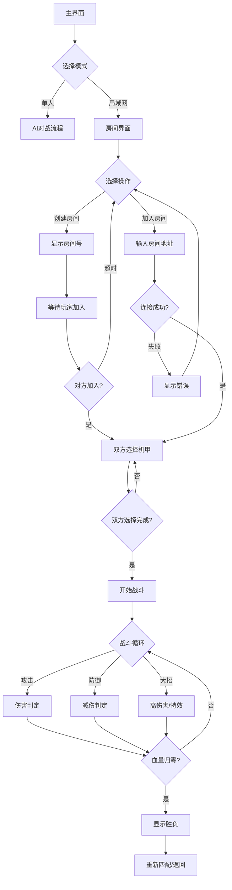

# 像素风机甲对战游戏 - 产品需求文档（局域网联机版）

## 1. 产品概述

一款复古像素风格的机甲对战小游戏，支持**局域网联机对战**，适配**移动端触摸操作**。两位玩家连接同一WiFi后，可通过创建/搜索房间进行1v1实时对战。

- **核心目标**：通过移动、攻击、防御等操作削减对方血量，最终击溃对手
- **目标用户**：移动端玩家、朋友间本地对战
- **产品价值**：无需互联网，零延迟本地对战，随时随地开黑

## 2. 核心功能

### 2.1 游戏模式

| 模式 | 说明 |
|-----|------|
| **单人练习** | 与AI对战，熟悉操作 |
| **局域网对战** | 创建房间等待加入，或搜索房间加入 |

### 2.2 机甲角色

| 角色名称 | 外观特点 | 攻击类型 | 特色 |
|---------|---------|---------|------|
| 红色机甲「烈焰」 | 红色系、火焰涂装 | 近战拳击 | 攻击力高 |
| 蓝色机甲「寒霜」 | 蓝色系、冰霜涂装 | 远程激光 | 攻击距离远 |

### 2.3 功能模块

#### 2.3.1 主界面
- 游戏Logo展示
- 「单人练习」按钮
- 「局域网对战」按钮
- 音效开关

#### 2.3.2 房间系统
- **创建房间**：生成本设备IP地址+房间号，分享给好友
- **搜索房间**：输入对方IP地址连接
- **房间内等待**：显示双方已准备状态
- **取消匹配**：返回主界面

#### 2.3.3 机甲选择
- 显示两个机甲预览
- 悬停/点击显示机甲属性
- 确认选择后锁定

#### 2.3.4 对战场景
- 像素风格工业场景
- 地面平台
- 背景装饰

#### 2.3.5 战斗系统
- 血量显示（每方100点）
- 能量条（用于释放大招）
- 攻击动画与特效
- 防御姿态
- 胜负判定

#### 2.3.6 移动端触摸控制
- **左侧区域**：虚拟摇杆（移动）
- **右侧区域**：
  - 攻击按钮（大圆形）
  - 防御按钮（小方形）
  - 大招按钮（闪烁特效）
- **按钮透明度**：半透明，不遮挡游戏画面

#### 2.3.7 结算界面
- 胜/败显示
- 重新匹配按钮
- 返回主界面按钮

## 3. 核心流程

### 3.1 联机对战流程图

### 3.2 伤害计算

- 普通攻击：造成15点伤害
- 大招攻击：造成35点伤害，消耗全部能量
- 防御状态：受到伤害减少70%
- 能量恢复：每2秒恢复10点能量

## 4. 视觉设计

### 4.1 整体风格

- **风格定位**：90年代街机像素游戏风格
- **分辨率**：低分辨率像素渲染（320x180逻辑像素）
- **帧率**：60fps游戏循环

### 4.2 色彩方案

| 元素 | 颜色 | 说明 |
|-----|------|------|
| 主背景 | #1a1a2e | 深空蓝黑 |
| 地面 | #4a4e69 | 工业灰 |
| P1机甲 | #e63946 | 烈焰红 |
| P2机甲 | #4361ee | 寒霜蓝 |
| 血量条 | #2ec4b6 | 青色 |
| 能量条 | #f4a261 | 橙色 |
| UI文字 | #f1faee | 浅白 |
| 特效光效 | #ffd166 | 金黄 |
| 触摸按钮 | rgba(255,255,255,0.3) | 半透明白 |

### 4.3 移动端适配

- 全屏显示，竖屏/横屏均可
- 触摸按钮跟随手指位置微调
- 按键区域覆盖右下角40%屏幕
- 摇杆区域覆盖左下角40%屏幕

### 4.4 像素动画

- 机甲待机：2帧循环呼吸动画
- 机甲移动：4帧走路循环
- 攻击动作：3帧出拳/激光
- 防御动作：2帧举盾
- 受击反馈：闪烁+后退

### 4.5 特效设计

- 攻击命中：像素火花四散
- 大招释放：屏幕震动 + 光效
- 防御成功：能量盾波纹
- 胜负结算：大字特效动画

## 5. 网络同步方案

### 5.1 同步策略

- **帧同步**：每帧同步输入指令，而非游戏状态
- **延迟补偿**：本地预测+服务器校验
- **带宽优化**：仅传输关键事件（攻击、受伤、技能释放）

### 5.2 数据包类型

| 类型 | 内容 | 频率 |
|-----|------|------|
| 输入同步 | 移动方向、按键状态 | 每帧 |
| 攻击事件 | 攻击类型、目标位置 | 按需 |
| 伤害事件 | 伤害值、受伤方 | 按需 |
| 回合结束 | 胜负结果 | 游戏结束时 |

## 6. 验收标准

- [ ] 移动端触摸控制流畅
- [ ] 虚拟摇杆响应灵敏
- [ ] 局域网房间创建/搜索功能正常
- [ ] 双人联机对战延迟低
- [ ] 攻击防御逻辑正确
- [ ] 胜负判定准确
- [ ] 像素风格视觉完整
- [ ] 无明显卡顿或同步问题
