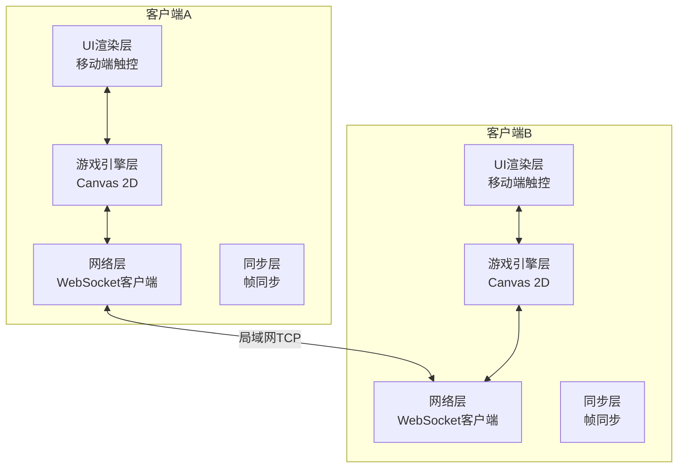
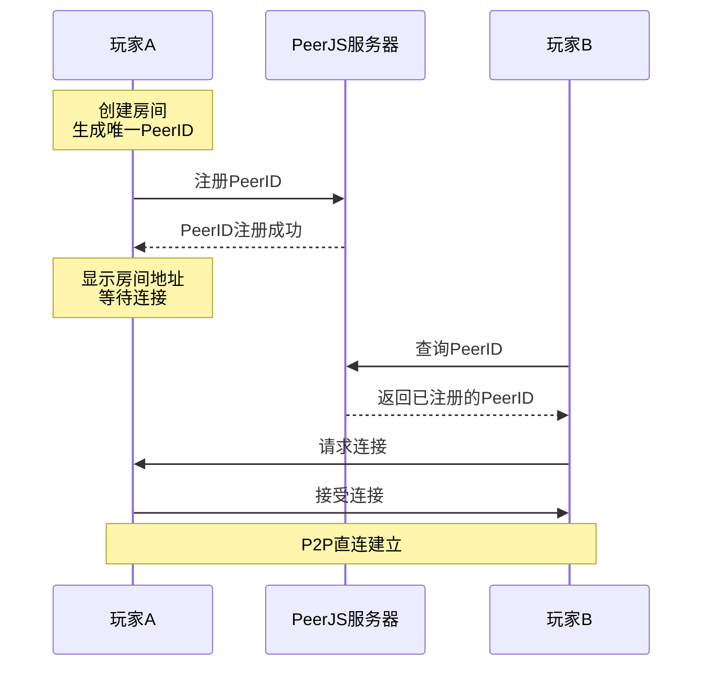

# 像素风机甲对战游戏 - 技术架构文档（局域网联机版）

## 1. 架构设计



## 2. 技术选型

| 类别 | 技术 | 说明 |
|-----|------|------|
| 前端框架 | 原生HTML5 | 跨平台，无需安装 |
| 渲染 | Canvas 2D API | 像素-perfect渲染 |
| 网络 | WebSocket | 实时双向通信 |
| 信令服务 | PeerJS + WebRTC | P2P连接方案 |
| 音频 | Web Audio API | 8-bit风格音效 |
| 输入 | Touch Events | 移动端触摸 |

## 3. 网络架构

### 3.1 P2P连接方案（推荐）

使用WebRTC实现真正的P2P直连，无服务器中转：

```
设备A <--WebRTC P2P--> 设备B
```

- **优势**：低延迟、无服务器成本
- **实现**：使用PeerJS简化WebRTC连接过程

### 3.2 连接流程



## 4. 文件结构

```
/workspace
├── index.html          # 单文件完整游戏
├── SPEC.md             # 规格说明
└── .trae/
    └── documents/
        ├── PRD-pixel-mecha-battle.md
        └── Technical-Architecture.md
```

## 5. 核心模块设计

### 5.1 游戏状态机

```javascript
GameState: 'menu' | 'select' | 'battle' | 'result'
```

| 状态 | 进入条件 | 退出条件 |
|-----|---------|---------|
| menu | 游戏启动 | 点击开始 |
| select | 双方连接成功 | 双方选择完成 |
| battle | select结束 | 某方血量归零 |
| result | battle结束 | 点击重新开始 |

### 5.2 机甲实体结构

```javascript
interface Mecha {
    id: string;              // 玩家ID
    x: number;               // X坐标
    y: number;               // Y坐标
    width: number;           // 宽度
    height: number;          // 高度
    hp: number;              // 当前血量
    maxHp: number;           // 最大血量
    energy: number;          // 当前能量
    maxEnergy: number;       // 最大能量
    speed: number;           // 移动速度
    facing: 'left'|'right';  // 朝向
    state: 'idle'|'walk'|'attack'|'defend'|'hit'|'ultimate'; // 状态
    animFrame: number;       // 动画帧
    animTimer: number;       // 动画计时器
    attackCooldown: number;  // 攻击冷却
    invincible: boolean;     // 无敌状态
}
```

### 5.3 网络同步协议

```javascript
// 输入命令结构
interface InputCommand {
    playerId: string;
    timestamp: number;
    direction: { x: number; y: number };
    attack: boolean;
    defend: boolean;
    ultimate: boolean;
}

// 游戏事件结构
interface GameEvent {
    type: 'hit' | 'damage' | 'sync' | 'end';
    data: any;
    timestamp: number;
}
```

### 5.4 战斗系统

```javascript
// 伤害计算
function calculateDamage(attacker, defender, isUltimate) {
    let baseDamage = isUltimate ? 35 : 15;
    let multiplier = defender.state === 'defend' ? 0.3 : 1;
    return Math.floor(baseDamage * multiplier);
}

// 能量恢复
function regenerateEnergy(mecha) {
    mecha.energy = Math.min(mecha.maxEnergy, mecha.energy + 10);
}
```

## 6. 移动端触摸控制

### 6.1 虚拟摇杆

```javascript
// 左侧40%屏幕区域
class VirtualJoystick {
    touchId: number;
    baseX: number;
    baseY: number;
    knobX: number;
    knobY: number;
    direction: { x: number; y: number };
    
    handleTouchStart(e) { ... }
    handleTouchMove(e) { ... }
    handleTouchEnd(e) { ... }
    getDirection() { return this.direction; }
}
```

### 6.2 技能按钮

```javascript
// 右侧40%屏幕区域
// 攻击按钮 - 大圆形，半透明
// 防御按钮 - 小方形，半透明
// 大招按钮 - 特殊样式，闪烁效果
```

## 7. 像素渲染策略

```javascript
// 像素-perfect渲染设置
ctx.imageSmoothingEnabled = false;

// 逻辑分辨率
const LOGICAL_WIDTH = 320;
const LOGICAL_HEIGHT = 180;

// 触摸按钮透明度
const BUTTON_ALPHA = 0.3;
```

## 8. PeerJS集成

```html
<script src="https://unpkg.com/peerjs@1.5.2/dist/peerjs.min.js"></script>
```

```javascript
// 创建连接
const peer = new Peer('unique-room-id');

// 监听连接
peer.on('connection', (conn) => {
    conn.on('data', handleGameData);
    conn.on('open', () => console.log('Connected!'));
});

// 连接到房间
const conn = peer.connect('target-peer-id');
conn.on('open', () => {
    conn.send({ type: 'ready' });
});
```

## 9. 性能优化

- 使用requestAnimationFrame进行游戏循环
- 粒子池化复用
- 离屏Canvas预渲染静态元素
- 避免运行时对象创建
- 触摸事件节流（16ms）

## 10. 错误处理

| 场景 | 处理方案 |
|-----|---------|
| 连接超时 | 显示重试按钮 |
| 连接断开 | 显示断线提示，返回主界面 |
| 同步失败 | 本地回滚到最后一致状态 |
| 触摸不支持 | 提示使用支持触摸的设备 |
