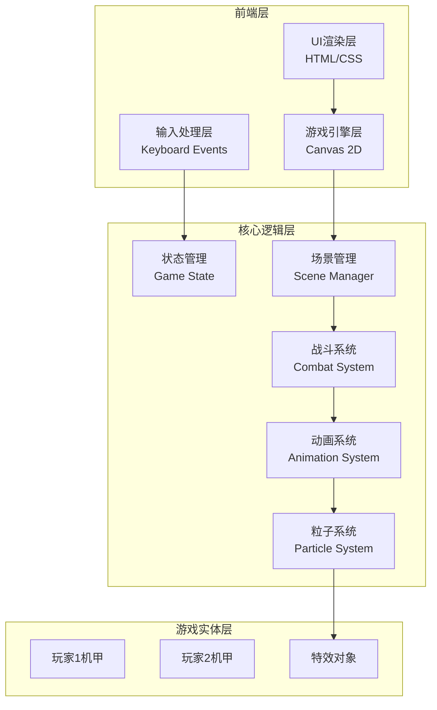

# 像素风机甲对战游戏 - 技术架构文档

## 1. 架构设计



## 2. 技术选型

| 类别 | 技术 | 说明 |
|-----|------|------|
| 核心 | 原生HTML5 + Canvas | 轻量化，无需构建工具 |
| 渲染 | Canvas 2D API | 像素-perfect渲染 |
| 音频 | Web Audio API | 8-bit风格音效 |
| 输入 | Keyboard Events | 双人键盘控制 |

## 3. 核心模块设计

### 3.1 游戏状态机

```
GameState: 'menu' | 'select' | 'battle' | 'result'
```

| 状态 | 进入条件 | 退出条件 |
|-----|---------|---------|
| menu | 游戏启动 | 点击开始 |
| select | menu结束 | 双方选择完成 |
| battle | select结束 | 某方血量归零 |
| result | battle结束 | 点击重新开始 |

### 3.2 机甲实体结构

```typescript
interface Mecha {
    x: number;           // X坐标
    y: number;           // Y坐标
    width: number;       // 宽度
    height: number;      // 高度
    hp: number;          // 当前血量
    maxHp: number;       // 最大血量
    energy: number;      // 当前能量
    maxEnergy: number;   // 最大能量
    speed: number;       // 移动速度
    facing: 'left'|'right'; // 朝向
    state: 'idle'|'walk'|'attack'|'defend'|'hit'|'ultimate'; // 状态
    animFrame: number;   // 动画帧
    animTimer: number;   // 动画计时器
    attackCooldown: number; // 攻击冷却
    invincible: boolean; // 无敌状态
}
```

### 3.3 战斗系统

```javascript
// 伤害计算
function calculateDamage(attacker, defender, isUltimate) {
    let baseDamage = isUltimate ? 35 : 15;
    let multiplier = defender.state === 'defend' ? 0.3 : 1;
    return Math.floor(baseDamage * multiplier);
}

// 能量恢复
function regenerateEnergy(mecha) {
    mecha.energy = Math.min(mecha.maxEnergy, mecha.energy + 10);
}
```

## 4. 文件结构

```
/workspace
├── index.html          # 主入口
├── SPEC.md             # 规格说明
└── .trae/
    └── documents/
        ├── PRD-pixel-mecha-battle.md
        └── Technical-Architecture.md
```

## 5. 像素渲染策略

```javascript
// 像素-perfect渲染设置
ctx.imageSmoothingEnabled = false;

// 逻辑分辨率
const LOGICAL_WIDTH = 320;
const LOGICAL_HEIGHT = 180;

// 显示缩放
const SCALE = 3;

// 渲染时缩放
ctx.scale(SCALE, SCALE);
```

## 6. 粒子系统设计

```javascript
class Particle {
    constructor(x, y, color) {
        this.x = x;
        this.y = y;
        this.vx = (Math.random() - 0.5) * 4;
        this.vy = (Math.random() - 0.5) * 4 - 2;
        this.life = 30;
        this.color = color;
        this.size = 2;
    }
    
    update() {
        this.x += this.vx;
        this.y += this.vy;
        this.vy += 0.2; // 重力
        this.life--;
    }
    
    draw(ctx) {
        ctx.fillStyle = this.color;
        ctx.fillRect(Math.floor(this.x), Math.floor(this.y), this.size, this.size);
    }
}
```

## 7. 音效系统

使用Web Audio API合成8-bit风格音效：

- **攻击音效**：短促的方波
- **命中音效**：噪声爆发
- **防御音效**：低频嗡鸣
- **大招音效**：多音调叠加
- **胜利音效**：上行旋律

## 8. 输入处理

```javascript
// 键盘映射
const CONTROLS = {
    player1: {
        up: 'KeyW',
        down: 'KeyS',
        left: 'KeyA',
        right: 'KeyD',
        attack: 'KeyJ',
        defend: 'KeyK',
        ultimate: 'KeyU'
    },
    player2: {
        up: 'ArrowUp',
        down: 'ArrowDown',
        left: 'ArrowLeft',
        right: 'ArrowRight',
        attack: 'Numpad1',
        defend: 'Numpad2',
        ultimate: 'Numpad3'
    }
};
```

## 9. 性能优化

- 使用requestAnimationFrame进行游戏循环
- 粒子池化复用
- 离屏Canvas预渲染静态元素
- 避免运行时对象创建
